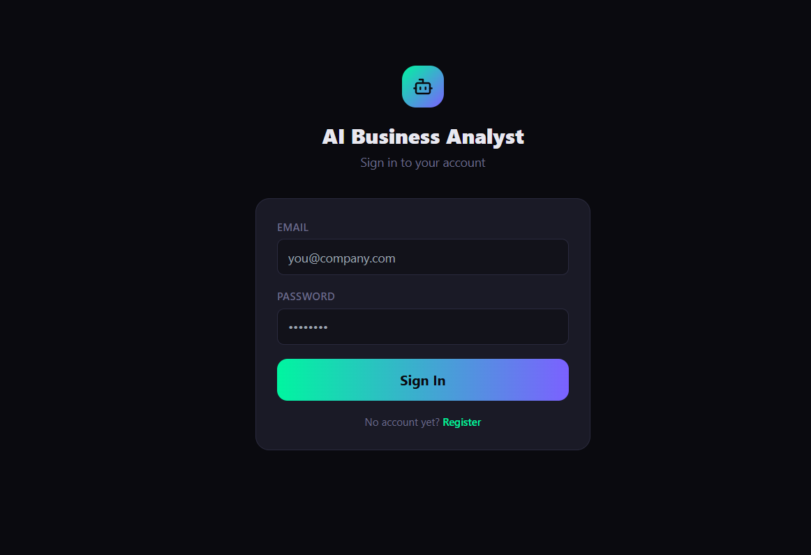

# 🤖 AI Business Data Analyst — SaaS Platform

> A production-ready Full Stack AI SaaS platform that acts as an **AI Data Analyst for businesses**.
> Upload datasets, describe your business problem, and get instant insights, charts, SQL queries, Python scripts, and executive reports.

[](https://ai-analyst-saas-shailesh-khoares-projects.vercel.app)
[](https://ai-analyst-saas-production.up.railway.app)
[](LICENSE)

---

## 🌐 Live Demo

🔗 **[https://ai-analyst-saas-shailesh-khoares-projects.vercel.app](https://ai-analyst-saas-shailesh-khoares-projects.vercel.app)**

> Register a free account, upload a CSV or Excel file, and start analysing your data instantly.

### 📸 Screenshots

| Login Page                        | Dashboard                                 |
| --------------------------------- | ----------------------------------------- |
|  |  |

---

## ✨ Key Features

- 📂 **CSV / Excel Upload** — schema detection, column profiling, data preview
- 🔬 **AI Analysis** — descriptive, diagnostic, trend and anomaly detection
- 📊 **Interactive Dashboard** — real KPIs and charts from your data
- 💬 **Chat with your Data** — ask questions in plain English
- 🗄️ **SQL Query Generator** — auto-generate queries from natural language
- 🐍 **Python Script Generator** — downloadable analysis scripts
- 📗 **Excel Formula Generator** — column-level formula suggestions
- 📄 **Report Export** — generate PDF / PowerPoint executive reports
- 🌙 **Light / Dark Theme** — Zinc design system
- 🔐 **JWT Authentication** — secure login and registration

---

## 🏗️ Architecture

```
ai-analyst-saas/
├── frontend/          # Next.js 14 + Tailwind + Recharts + Zustand
├── backend/           # Python FastAPI + SQLAlchemy + Pandas
├── ai_services/       # Statistical analysis engine
├── infra/             # Docker, Nginx, CI/CD
└── docker-compose.yml
```

---

## 📦 Tech Stack

| Layer         | Technology                                  |
| ------------- | ------------------------------------------- |
| Frontend      | Next.js 14, Tailwind CSS, Recharts, Zustand |
| Backend       | FastAPI, SQLAlchemy, Pydantic               |
| Data Analysis | Pandas, NumPy, Scikit-learn                 |
| Database      | PostgreSQL                                  |
| Cache / Queue | Redis, Celery                               |
| Auth          | JWT + OAuth2                                |
| Deployment    | Vercel (frontend) + Railway (backend + DB)  |

---

## 🚀 Run Locally

### Prerequisites

- Node.js 18+
- Python 3.11+
- PostgreSQL
- Redis

### 1. Clone the repository

```bash
git clone https://github.com/Get-Shailesh/ai-analyst-saas
cd ai-analyst-saas
```

### 2. Backend setup

```bash
cd backend
python -m venv .venv
.venv\Scripts\activate  # Windows
pip install -r requirements.txt
uvicorn app.main:app --reload --port 8000
```

### 3. Frontend setup

```bash
cd frontend
npm install
npm run dev
```

### 4. Celery worker

```bash
cd backend
.venv\Scripts\activate
celery -A app.core.celery_app worker --loglevel=info --pool=solo
```

### 5. Access the app

- **Frontend:** http://localhost:3000
- **API Docs:** http://localhost:8000/docs

---

## 🚢 Deployment

| Service     | Platform | Status  |
| ----------- | -------- | ------- |
| Frontend    | Vercel   | ✅ Live |
| Backend API | Railway  | ✅ Live |
| PostgreSQL  | Railway  | ✅ Live |

---

## 👤 Author

Built by **Shailesh Khoare**

---

## 📄 License

This project is licensed under the MIT License.
